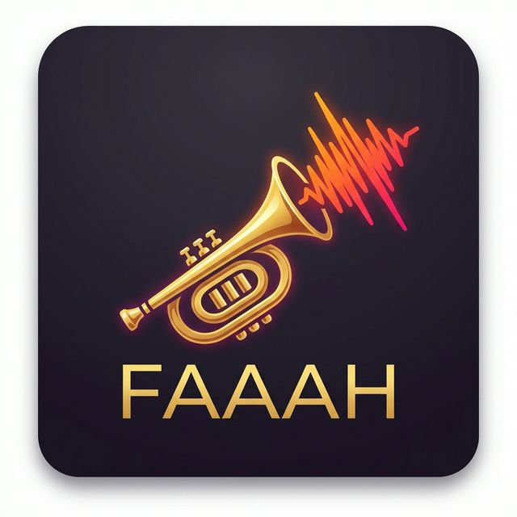

# FAAAH - Your Code's Worst Critic 🎺💥

A dramatic, zero-setup VS Code extension that plays a loud, cinematic **"FAAAH!"** sound effect whenever your code crashes, fails to compile, or your tests fail. 

Because failures deserve to be felt.

## Features

- **Zero-Config Crash Detection**: Automatically hooks into the popular **Code Runner** extension to detect crashes across multiple languages.
- **Test Runner Integration**: Detects failure outputs natively in the terminal and via the VS Code Testing API.
- **Customizable Sounds**: Drop your own `.wav` files into the extension to customize the dramatic feedback!
- **Non-Intrusive**: Runs silently in the background.

## 🚀 Supported Languages

Out-of-the-box, FAAAH instantly detects execution crashes and compilation errors when you hit **Play** using Code Runner for the following languages:

- **JavaScript / Node.js**
- **Python**
- **C++**
- **C**
- **Java**

*(Just write broken code, hit play, and hear the magic).*

## How It Works

VS Code is highly secure and prevents extensions from directly reading your terminal output. To solve this, **FAAAH** uses a clever native system integration:
It seamlessly injects a fallback operator (`|| aplay [sound]`) into the execution pipeline. If the executed process returns a non-zero exit code (i.e., a crash), your operating system instantly evaluates the fallback and blasts the audio!

### Commands
- `FAAAH: Toggle On/Off`
- `FAAAH: Play Sound` (Test the volume!)
- `FAAAH: Run Node Script` (Built-in fail-safe runner)

## Requirements
- Works flawlessly on **Linux** (uses `aplay`), **macOS** (uses `afplay`), and **Windows** (uses `powershell`).
- **[Code Runner](https://marketplace.visualstudio.com/items?itemName=formulahendry.code-runner)** extension is highly recommended for the best experience.

## Configuration

You can customize the extension through VS Code settings (`Ctrl+,` -> search `FAAAH`):

- `faaah.enabled`: Turn it off when you're in a library.
- `faaah.volume`: Adjust the macOS blast radius.
- `faaah.cooldownMs`: Time between sounds to prevent spam.

## Enjoy the chaos!
